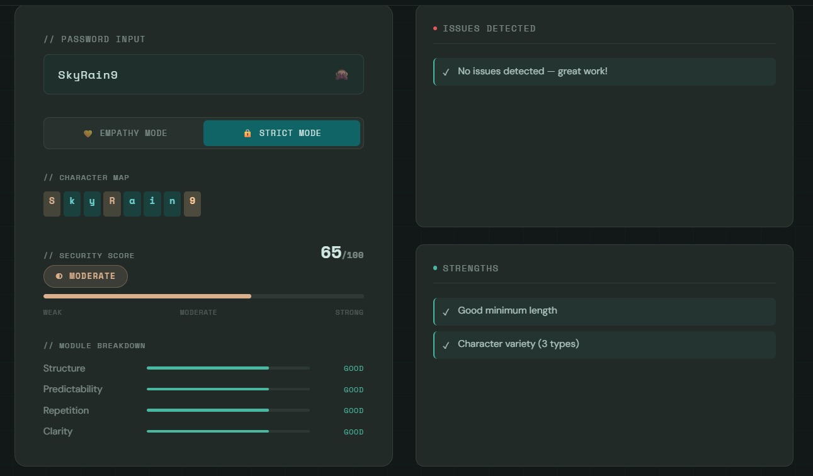

# Empathy Encryption Engine

A human-centered password validation system that rethinks security through the lens of usability.

Traditional password validators enforce rigid rule-based constraints (minimum length, required symbols, etc.) without considering how humans actually create, remember, and communicate passwords.

The **Empathy Encryption Engine** evaluates passwords based on intentional structure, balance, clarity, and meaningful composition — not arbitrary checklists.

---

## 🔗 Live Demo

> `https://your-app-name.onrender.com`

---

# Core Philosophy

Instead of asking:

> “Does this password meet technical requirements?”

This system asks:

* Is this password intentionally constructed?
* Does it balance memorability with security?
* Does it reflect human structure instead of machine randomness?
* Can it be clearly read and communicated?

Security and usability should not be enemies.

---

# Key Features

## Dual Validation Modes

### Empathy Mode (Recommended)

A human-centered validation system with binary acceptance.

**Validation Components:**

* Shannon Entropy Analysis (information theory)
* Human structure detection (CamelCase, word+symbol+number, embedded years)
* Keyboard walk detection (sliding window analysis)
* Advanced repetition scoring
* Intentionality heuristics
* Visual clarity evaluation
* Common password blocklist

**Decision Model:**
Hard rejections + weighted scoring → final binary result (Valid / Invalid)

---

### Strict Mode

Traditional rule-based scoring model for comparison.

**Features:**

* Length requirement (≥ 8)
* 2+ character types required
* Common password blocking
* Keyboard pattern penalty (not rejection)
* 0–100 scoring scale
* Strength levels: Weak / Moderate / Strong

---
## Screenshots




---

# 🛠 Tech Stack

* Node.js
* Express.js
* Vanilla JavaScript
* HTML5 / CSS3
* Modular validation architecture
* Shannon Entropy (information theory principles)

---

# User Experience Highlights

* Live real-time validation
* Toggle between empathy and strict modes
* Visual progress indicators
* Issue and positive feedback lists
* Password composition breakdown
* Glassmorphism-inspired modern UI
* Responsive layout (desktop + mobile)

---

# Quick Start

## Prerequisites

* Node.js (v16+)
* npm

## Installation

```bash
git clone https://github.com/Shreeja-88/empathy-encryption-engine.git
cd empathy-encryption-engine
npm install
```

## Running the Application

```bash
npm start
```

Then open:

```
http://localhost:5000
```

(Frontend is served directly by the Express backend.)

---

# 📡 API Documentation

## POST `/validate`

Validates a password using the selected mode.

### Request

```json
{
  "password": "yourpassword",
  "mode": "empathy"
}
```

* `mode` can be `"empathy"` or `"strict"`
* Default mode: `"empathy"`

---

### Response

```json
{
  "score": 85,
  "strength": "Strong",
  "issues": [],
  "positives": [
    "Meets all empathy encryption principles",
    "Good intentional structure and balance"
  ],
  "isValid": true
}
```

---

# Mode Comparison Examples

| Password       | Empathy Mode | Strict Mode | Explanation                                      |
| -------------- | ------------ | ----------- | ------------------------------------------------ |
| `xKzQpWmTnL9#` | ❌ Reject     | ✅ Accept    | Machine-generated pattern lacks human structure  |
| `Hello123`     | ✅ Accept     | ✅ Accept    | Balanced and intentional                         |
| `SkyRain9`     | ✅ Accept     | ❌ Reject    | Missing special character but structurally human |
| `qwerty12`     | ❌ Reject     | ✅ Accept    | Keyboard walk detected                           |

---

# Architecture

```
empathy-encryption-engine/
├── client/
│   ├── index.html
│   ├── script.js
│   └── style.css
├── server/
│   ├── index.js
│   ├── validator.js
│   └── checks/
│       ├── structure.js
│       ├── predictability.js
│       ├── repetition.js
│       ├── visual.js
│       └── keyboard.js
├── package.json
└── README.md
```

The system follows a modular validation architecture, allowing individual heuristics to remain isolated, testable, and extensible.

---

# Validation Logic Overview

## Empathy Mode

### Hard Rejections

* Length < 8 or > 64
* Common password list
* All identical characters
* Pure numeric or alphabetic
* Keyboard walk detection
* 5+ consecutive identical characters
* Excessive randomness without structure

### Weighted Evaluation

* Length bonuses (10+, 12+)
* Character variety (3+ types required)
* Entropy balance (2.5–4.8 bits/char optimal)
* Unique character ratio (0.4–0.85 preferred)
* Repetition penalty
* Human structure bonus
* Ambiguous character penalty

Final Requirement: Score ≥ threshold → Valid

---

## Strict Mode

* Length ≥ 8
* Minimum 2 character types
* Not in common password list
* Length bonuses
* Variety scoring
* Keyboard penalty

Strength Scale:

* 0–39 → Weak
* 40–69 → Moderate
* 70+ → Strong

---

# Why This Project Matters

Poor password UX often leads to:

* Password reuse
* Unsafe storage practices
* User frustration
* Reduced security compliance

This project explores how empathy-driven validation can encourage better password behavior without punishing human memory patterns.

It is an experiment in blending usability and security rather than treating them as opposites.

---

# Contributing

1. Fork the repository
2. Create a feature branch
3. Implement improvements
4. Add tests for validation logic
5. Submit a pull request

---

# Acknowledgments

* UnsaidTalks Education Hackathon Challenge
* Human-Centered Design principles
* Information Theory foundations

---

# Author

**Shreeja Hebbar**
Computer Science Engineering Student
Focused on human-centered systems and full-stack development.
